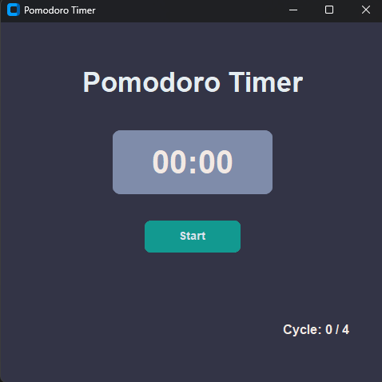

# 🍅 Pomodoro Timer

An elegant and functional Pomodoro Timer built with Python and CustomTkinter to boost your productivity.

## 📸 Screenshot



## ✨ Features

- **Classic Pomodoro Technique**: 25 minutes of work, 5 minutes of break
- **4 complete cycles** with automatic switching
- **Modern dark interface** with pleasant color scheme
- **Audio notifications** when each period ends
- **Intuitive controls**: Start, Stop, Continue, Clear
- **Cycle counter** in the bottom right corner
- **Cross-platform** (Windows, macOS, Linux)

## 🚀 Quick Start

### Requirements

- Python 3.7+
- customtkinter
- winsound (included in Python standard library on Windows)

### Installation

1. Clone the repository:
```bash
git clone https://github.com/yourusername/pomodoro-timer.git
cd pomodoro-timer
```

2. Install dependencies:
```bash
pip install customtkinter
```

3. Run the application:
```bash
python pomodoro_timer.py
```

## 📦 Building Executable

To create a standalone .exe file:

1. Install PyInstaller:
```bash
pip install pyinstaller
```

2. Build the exe file:
```bash
pyinstaller --onefile --windowed --name "PomodoroTimer" pomodoro_timer.py
```

The ready exe file will be located in the `dist/` folder.

## 🎯 How to Use

1. **Launch the application** and click the "Start" button
2. **Work for 25 minutes** - the timer will show remaining time
3. **Take a 5-minute break** when the sound notification plays
4. **Repeat for 4 cycles** for a complete Pomodoro session
5. Use **Stop/Continue** to pause, **Clear** to reset

## 🛠 Technical Details

- **GUI Framework**: CustomTkinter
- **Audio Notifications**: winsound (Windows)
- **Architecture**: Object-oriented programming
- **Timer**: Uses tkinter.after() for non-blocking updates

## 🎨 Color Scheme

- **Background**: `#333446` (Dark Gray)
- **Timer**: `#7F8CAA` (Blue-Gray)
- **Text**: `#F2E9E4` (Light Beige)
- **Start Button**: `#129990` (Green)
- **Stop Button**: `#DC3C22` (Red)


## 📝 Changelog

### v1.0.0
- Initial release
- Core Pomodoro timer functionality
- Modern UI with dark theme
- Audio notifications